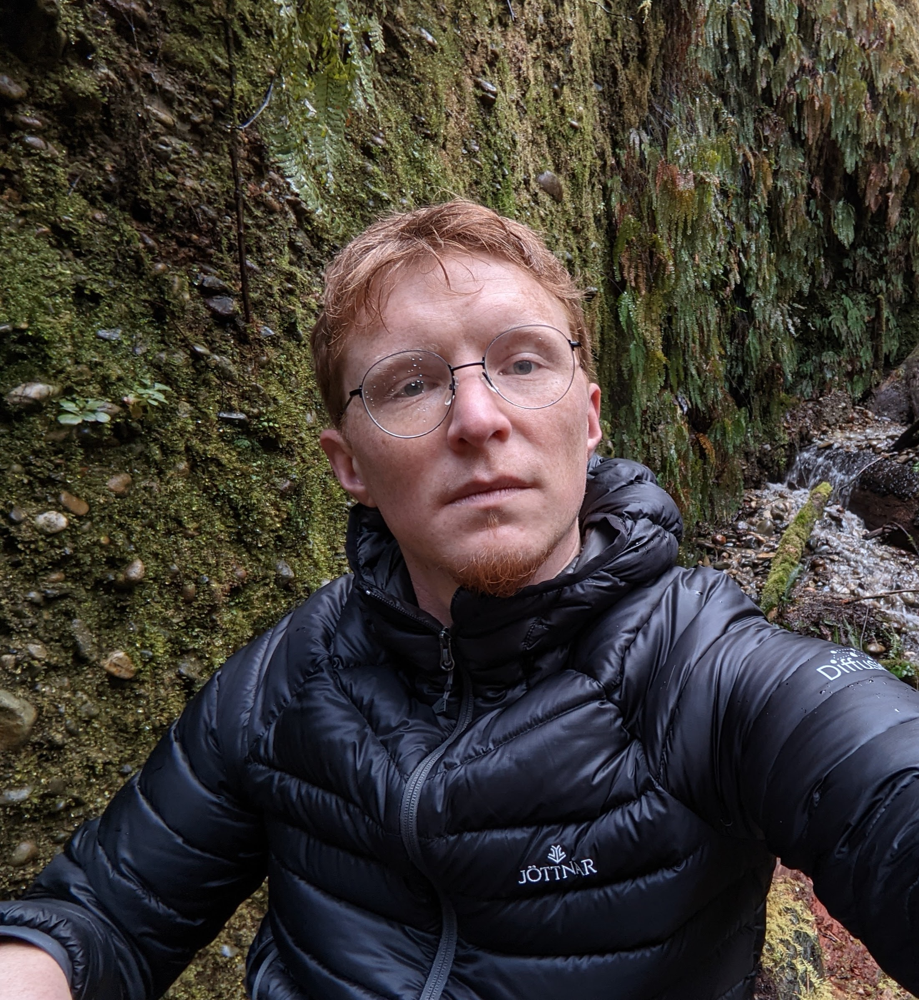

I’m a Research Scientist at [Google](http://hooli.com/) working on graph learning and social networks. In 2017 I received a Ph.D. in Statistics from the Department of Statistics and Operations Research (STOR) at UNC Chapel Hill, with a dissertation focusing on graph ML and computational genomics. My thesis advisors were [Andrew Nobel](http://nobel.web.unc.edu/) and [Shankar Bhamidi](http://shankarbhamidi.web.unc.edu/). Throughout my degree I was an active member of a working group in the [GTEX Project](https://commonfund.nih.gov/GTEx), and part of the [Probability Group at UNC](http://probabilitygroup.web.unc.edu/).

### Publications

* Yoon, Minji; __Palowitch, John__; Zelle, Dustin; Hu, Ziniu; Salakhutdinov, Rusl; Perozzi, Bryan. "*Zero-shot Domain Adaptation of Heterogeneous Graphs via Knowledge Transfer Networks*" [(arxiv)](https://arxiv.org/abs/2203.02018)
* __Palowitch, John__; Tsitsulin, Anton; Mayer, Brandon; Perozzi, Bryan. "*GraphWorld: Fake Graphs Bring Real Insights For GNNs*" [(arxiv)](https://arxiv.org/abs/2203.00112)
* Huang, Di; Bartel, Jacob; __Palowitch, John__. "*Recurrent Graph Neural Networks for Rumor Detection in Online Forums*" [KDD MIS2 '21](http://claws.cc.gatech.edu/mis2-kdd2021) [(arxiv)](https://arxiv.org/abs/2108.03548)
* Tsitsulin, Anton; Benedek, Rozemberczki; __Palowitch, John__; Perozzi, Bryan. "*Synthetic Graph Generation to Benchmark Graph Learning*" [WWW GLB '21](https://graph-learning-benchmarks.github.io/assets/papers/GLB_Synthetic_Graph_Generation_Benchmark.pdf)
* Dewaskar, Miheer; __Palowitch, John__; He, Mark; Love, Michael; Nobel, Andrew B. "*Finding Stable Groups of Cross-Correlated Features in Multi-View data*" [arxiv:2009.05079](https://arxiv.org/pdf/2009.05079.pdf)
* Tsitsulin, Anton; __Palowitch, John__; Perozzi, Bryan; Müller, Emmanuel. "*Graph Clustering with Graph Neural Networks*" [arxiv:2006.16904](https://arxiv.org/abs/2006.16904)
* __Palowitch, John__; Perozzi, Bryan; "*MONET: Debiasing Graph Embeddings via the Metadata-Orthogonal Training Unit*" [2020 IEEE/ACM International Conference on Advances in Social Networks Analysis and Mining (ASONAM)](https://ieeexplore.ieee.org/abstract/document/9381348)
* __Palowitch, John__; "*Computing the statistical significance of optimized communities in networks.*" [Nature Scientific Reports, 9, 2019](https://www.nature.com/articles/s41598-019-54708-8)
* __Palowitch, John__; Bhamidi, Shankar; Nobel, Andrew B. “*Significance-based community detection in weighted networks*.” [Journal of Machine Learning Research, 18(188), 2018](http://www.jmlr.org/papers/v18/17-377.html)
* __Palowitch, John__; Zhou, Yihui; Shabalin, Andrey; Zhou, Yihui; Nobel, Andrew B.; Wright, Fred A. “*Estimation of Interpretable eQTL Effect Sizes Using a Log of Linear Model*.” [Biometrics, 74(2), 2017](https://onlinelibrary.wiley.com/doi/abs/10.1111/biom.12810)
* Wilson, James D.; __Palowitch, John__; Bhamidi, Shankar; Nobel, Andrew B. “*Significance Based Extraction in Multilayer Networks with Heterogeneous Community Structure*.” [Journal of Machine Learning Research, 18(149), 2017](http://www.jmlr.org/papers/v18/16-645.html)
* Aguet, Francois; Wright, Fred A.; Lappalainen, Tulli; Ardlie, Kristin G.; Dermitzakis, Emmanouil T.; Brown, Christopher D.; Montgomery, Stephen D; __Palowitch, John__; the GTEx Consortium. “*Genetic effects on gene expression across human tisues*.” [Nature, 550, 2017](https://www.nature.com/articles/nature24277)
* Saha, Ashis; ...; The GTEx Consortium; Engelhardt, Barbara E.; Battle, Alexis. "*Co-expression networks reveal the tissue-specific regulation of transcription and splicing*." [Genome Research, 28(7), 2018](https://genome.cshlp.org/content/early/2017/10/06/gr.216721.116.abstract)
* Yang, Fan; Wang, Jiebia; The GTEx Consortium; Pierce, Brandon L.; Chen, Lin S. "*Identifying cis-mediators for trans-eQTLs across many human tissues using genomic mediation analysis.*" [Genome Research, 28(7), 2018](https://genome.cshlp.org/content/27/11/1859)

### Past Conference Presentations
* [ASONAM 2020](http://asonam.cpsc.ucalgary.ca/2020/), December 7-10 2020
* [Graph Mining & Learning @ NEURIPS](https://gm-neurips-2020.github.io/), December 6 2020
* [SIAM NS20](https://www.siam.org/conferences/cm/conference/ns20), July 9-10 2020
* [Data Institute SF Annual Conference](http://www.sfdatainstitute.org/conference.html), March 11-12 2019
* [SIAM NS18](https://www.siam.org/meetings/ns18/), July 12-13 2018
* [Data Institute SF Annual Conference](http://www.sfdatainstitute.org/conference.html), October 16-17 2017
* [SIAM NS17](http://www.siam.org/meetings/ns17/), July 13-14 2017
* [Conference on Statistical Learning and Data Science](http://www.unc.edu/~yfliu/sldm2016/index.html), June 6-8 2017
* [Joint Statistical Meetings](https://www.amstat.org/meetings/jsm/2016/), July 30-August 4 2017

### Awards

* [Winner of 2017 Duke Datathon](http://www.dailytarheel.com/article/2017/04/unc-team-wins-20000-and-a-chance-at-a-job-from-datathon) (sponsored by Citadel, Citadel Securities, and Correlation One)
* [SSPA](http://community.amstat.org/sspa/home)/Monsanto Student Grant, 2015
