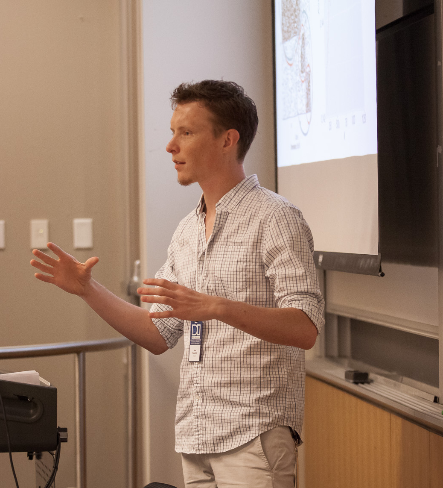

I’m a Data Scientist at [Google](http://hooli.com/). In 2017 I received my Ph.D. in Statistics from the Department of Statistics and Operations Research (STOR) at UNC Chapel Hill. My research interests include machine learning methods for networks, and computational genomics. My thesis advisors were [Andrew Nobel](http://nobel.web.unc.edu/) and [Shankar Bhamidi](http://shankarbhamidi.web.unc.edu/). Throughout my degree I was an active member of a working group in the [GTEX Project](https://commonfund.nih.gov/GTEx), and part of the [Probability Group at UNC](http://probabilitygroup.web.unc.edu/).

### Publications

* __Palowitch, John__; Bhamidi, Shankar; Nobel, Andrew B. “*Significance-based community detection in weighted networks*.” [Journal of Machine Learning Research, 18(188), 2018](http://www.jmlr.org/papers/v18/17-377.html)
* __Palowitch, John__; Zhou, Yihui; Shabalin, Andrey; Zhou, Yihui; Nobel, Andrew B.; Wright, Fred A. “*Estimation of Interpretable eQTL Effect Sizes Using a Log of Linear Model*.” [Biometrics, 74(2), 2017](https://onlinelibrary.wiley.com/doi/abs/10.1111/biom.12810)
* Wilson, James D.; __Palowitch, John__; Bhamidi, Shankar; Nobel, Andrew B. “*Significance Based Extraction in Multilayer Networks with Heterogeneous Community Structure*.” [Journal of Machine Learning Research, 18(149), 2017](http://www.jmlr.org/papers/v18/16-645.html)
* Aguet, Francois; Wright, Fred A.; Lappalainen, Tulli; Ardlie, Kristin G.; Dermitzakis, Emmanouil T.; Brown, Christopher D.; Montgomery, Stephen D; __Palowitch, John__; the GTEx Consortium. “*Genetic effects on gene expression across human tisues*.” [Nature, 550, 2017](https://www.nature.com/articles/nature24277)

### Upcoming Conference Presentations
* [SIAM NS18](https://www.siam.org/meetings/ns18/), July 12-13 2018

### Recent Conference Presentations

* [Data Institute SF Annual Conference](http://www.sfdatainstitute.org/conference.html), October 16-17 2017
* [SIAM NS17](http://www.siam.org/meetings/ns17/), July 13-14 2017
* [Conference on Statistical Learning and Data Science](http://www.unc.edu/~yfliu/sldm2016/index.html), June 6-8 2017
* [Joint Statistical Meetings](https://www.amstat.org/meetings/jsm/2016/), July 30-August 4 2017

### Awards

* [Winner of 2017 Duke Datathon](http://www.dailytarheel.com/article/2017/04/unc-team-wins-20000-and-a-chance-at-a-job-from-datathon) (sponsored by Citadel, Citadel Securities, and Correlation One)
* [SSPA](http://community.amstat.org/sspa/home)/Monsanto Student Grant, 2015
